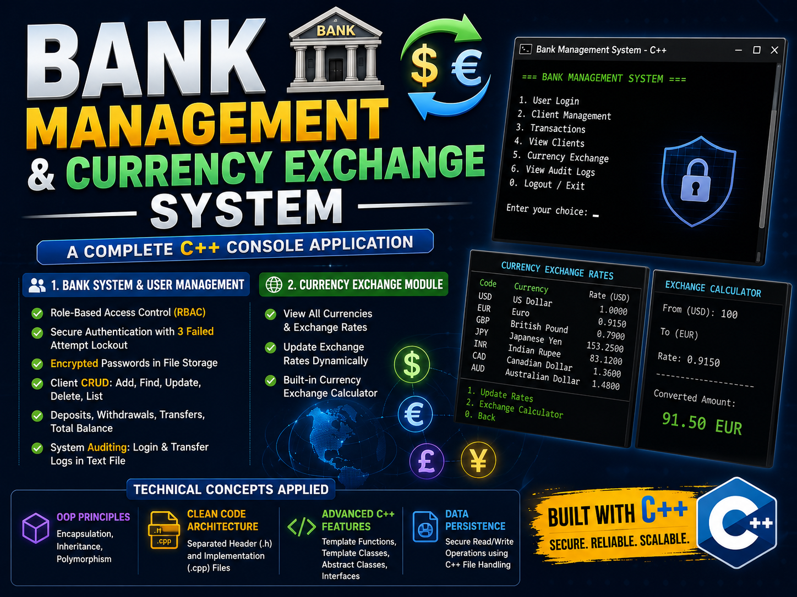

# Bank Management & Currency Exchange System 🏦💱
[](https://youtu.be/kBqSBB8qFhI)

### 🎥 Demo Video
https://youtu.be/kBqSBB8qFhI

## 📌 Overview

A comprehensive C++ console application that simulates a real-world banking environment and currency exchange module. This project was built to apply advanced **Object-Oriented Programming (OOP)** principles, secure file handling, and solid backend logical structuring.

## 🚀 Key Features

### 1. Bank System & User Management

* **Role-Based Access Control (RBAC):** Strict permission system for users and admins.
* **Authentication Security:** Secure login system with a lockout mechanism after 3 failed attempts, and password encryption in file storage.
* **Client Management:** Full CRUD operations (Add, Find, Update, Delete, List) for bank clients.
* **Financial Transactions:** Deposits, withdrawals, inter-account transfers, and total balance calculations.
* **System Auditing:** Automated logging for user logins and transfer operations into a dedicated text file.

### 2. Currency Exchange Module

* View a comprehensive list of available currencies and their rates.
* Update currency exchange rates dynamically.
* Built-in currency exchange calculator.

## 💻 Technical Concepts Applied

* **Object-Oriented Programming (OOP):** Encapsulation, Inheritance, and Polymorphism.
* **Clean Code Architecture:** Structured using separated Header (`.h`) and Implementation (`.cpp`) files.
* **Advanced C++ Features:** Template Functions, Template Classes, Abstract Classes, and Interfaces.
* **Data Persistence:** Secure read/write operations using C++ File Handling.

## 🛠️ How to Run

1. Clone the repository:

```bash
   git clone https://github.com/iabdlrhmn/C11_P3_Bank_System
